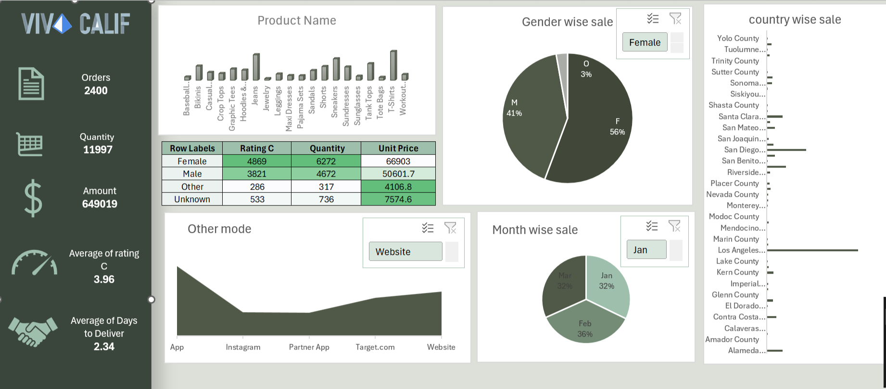

#  Viv◆Calif Sales Dashboard

> An interactive Excel dashboard for **Viv◆Calif** — a California-based fashion brand. Tracks orders, revenue, product performance, gender-wise sales, delivery metrics, and county-level distribution across California.



---

## About

The **Viv◆Calif Sales Dashboard** is a comprehensive retail analytics tool built in Microsoft Excel. It provides a 360° view of fashion sales — from product-wise performance to channel-wise trends and regional county breakdowns across California.

---

##  Key Metrics

| Metric | Value |
|---|---|
|  Total Orders | 2,400 |
|  Total Quantity | 11,997 units |
|  Total Amount | $649,019 |
| Average Rating | 3.96 |
| Avg Days to Deliver | 2.34 days |

---
##  Business Questions This Dashboard Answers

### Orders & Revenue
1. What is the **total revenue** generated by Viv◆Calif across all products and channels?
2. How many **total orders** were placed, and what is the overall **quantity sold**?
3. Which **sales channel** (App, Instagram, Partner App, Target.com, Website) contributes the most to total revenue?
4. How does **Website sales** compare to **Instagram** and **App** in terms of order volume?
5. What is the **average order value** across all channels?

###  Product Performance
6. Which **product** (Jeans, T-Shirts, Sneakers, Sandals, Workout, etc.) has the highest quantity sold?
7. What are the **Top 5 best-selling products** by total quantity?
8. Which product category has the **lowest sales volume** and may need promotion?
9. How do **Leggings vs Shorts** compare in terms of quantity sold?
10. Which products have the **highest unit price** and contribute most to revenue?

###  Gender-Wise Analysis
11. What is the **gender distribution** of customers — Female, Male, Other, Unknown?
12. Which gender segment generates the **highest revenue** (Female: $66,903 vs Male: $50,601)?
13. How does **average rating** differ between Female (4869) and Male (3821) customers?
14. Which gender places the **most orders by quantity** (Female: 6,272 vs Male: 4,672)?
15. What strategies can be used to increase sales to the **Male** customer segment?

###  Month-Wise Trends
16. Which **month** (Jan, Feb, Mar) has the highest share of total sales?
17. How does **February (36%)** compare to **January (32%)** and **March (32%)** in sales volume?
18. Are there **seasonal trends** that spike sales in specific months?
19. What is the **month-over-month growth rate** in orders?
20. Which products sell best in **January** vs **February**?

###  County-Wise (California) Analysis
21. Which **California county** generates the highest sales revenue?
22. How do **Los Angeles** and **San Diego** compare in terms of order volume?
23. Which counties have **consistently low sales** and represent untapped markets?
24. Are there regional patterns — do **Northern California** counties perform differently from **Southern California**?
25. Which **Top 5 counties** account for the majority of total revenue?

### Delivery & Operations
26. What is the **average delivery time** (2.34 days) across all orders and channels?
27. Which **sales channel** has the fastest average delivery time?
28. Are there counties where **delivery times are significantly longer**?
29. How does delivery performance affect **customer satisfaction ratings**?
30. What percentage of orders are delivered **within 2 days** vs 3+ days?

###  Ratings & Customer Satisfaction
31. What is the **overall average customer rating** (3.96) and how does it vary by product?
32. Which products consistently receive **ratings above 4.0**?
33. Is there a correlation between **delivery speed** and **customer rating**?
34. Which gender gives **higher average ratings** for purchases?
35. Which sales channel receives the **best customer satisfaction scores**?

---

##  Project Structure

```
vivcalif-dashboard/
├── excel_dashboard_2.xlsx   # Main Excel dashboard file
├── vivcalif.png             # Dashboard screenshot
└── README.md                # This file
```

---

##  Built With

- **Microsoft Excel** — Pivot Tables, Slicers, Charts, KPI Cards
- **Data Visualization** — Bar charts, Pie charts, Area charts, KPI tiles
- **Data Sheets** — Orders, Products, Customers, Summary

---

## How to Use

1. Download `excel_dashboard_2.xlsx`
2. Open in **Microsoft Excel 2016 or later**
3. Use the **Gender slicer** to filter by Female / Male / Other
4. Use the **Month slicer** to switch between Jan, Feb, Mar
5. Use the **Channel slicer** to filter by Website, App, Instagram, etc.
6. All KPIs, charts and tables update automatically

---


Made with ❤️ — feel free to fork and explore!
